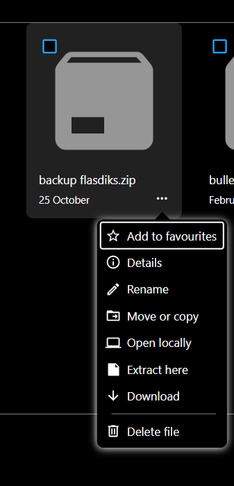

# NCExtrak

NCExtrak is a Nextcloud app that adds an Extract here action to the Files context menu.



## Features

- Extract archives from the Files context menu.
- Supported formats: ZIP, TAR, GZ, BZ2, RAR, and 7Z.

## Requirements

- PHP 8.2+
- Nextcloud 30-33

### Optional

- `p7zip` / `p7zip-full` for 7Z extraction
- `unrar` binary or PHP `rar` extension for RAR extraction

## Configuration

Set these values in `config/config.php` to override defaults:

```php
'ncextrak.profile' => 'home_server', // home_server|balanced|high_throughput
'ncextrak.sync_size_limit' => 8 * 1024 * 1024,
'ncextrak.max_entries' => 400000,
'ncextrak.max_size' => 2 * 1024 * 1024 * 1024 * 1024,
'ncextrak.work_dir' => '/mnt/fast-disk/ncextrak-work',
'ncextrak.work_reserve' => 8 * 1024 * 1024 * 1024,
'ncextrak.expected_expansion_factor' => 2,
```

Profiles: `home_server` (default), `balanced`, and `high_throughput`.

## Development

```bash
npm ci
composer install
npm run build
```

Lint and format:

```bash
npm run lint
composer run lint
npm run format
composer run format
```

## Manual installation

1. Download release zip from GitHub Releases.
2. Extract into `<nextcloud>/apps/ncextrak`.
3. Set ownership:
   - `chown -R www-data:www-data <nextcloud>/apps/ncextrak`
4. Enable app:
   - `sudo -u www-data php occ app:enable ncextrak`
5. Ensure Nextcloud cron is configured for background jobs.
